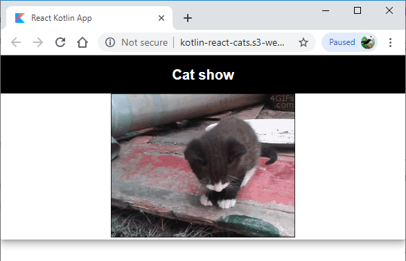

# Writing a React & Material UI application in Kotlin - Should you do it?

## Kotlin

I have been writing [Java](https://en.wikipedia.org/wiki/Java_(programming_language) and [Scala](https://www.scala-lang.org/) code for years now, and I recently decided to learn [Kotlin](https://kotlinlang.org/) too. It is often described as the middle ground between the other two languages, but I think that is unfair. It has many of its own unique features too such as [coroutines](https://kotlinlang.org/docs/reference/coroutines/coroutines-guide.html), [delegation](https://kotlinlang.org/docs/reference/delegation.html) and [multi platform](https://kotlinlang.org/docs/reference/multiplatform.html) support (via [Kotlin JS](https://kotlinlang.org/docs/reference/js-overview.html) and [Kotlin Native](https://kotlinlang.org/docs/reference/native-overview.html) which uses [LLVM](https://llvm.org/)).

## Single language full stack apps

With the advent of [Node.js](https://nodejs.org) the idea of writing full stack applications in a single language has become popular. I thought I would try my hand at this using Kotlin & Kotlin JS.

I did write a full stack app, but it turned out a bit too large for a blog post. Wanting to share what I found, I created this github repo for an app that shows a new cat photo every 2 seconds.

https://github.com/blackmamo/kotlin-kitties

## How I wrote my application

When it comes to writing front end code, I am most familiar with [React](https://reactjs.org/) and [Material UI](https://material-ui.com/), so I chose to use these technologies in this project too.

I am also a fan of [functional programming](https://en.wikipedia.org/wiki/Functional_programming), which leads me to write React using functional, as opposed to class based, components. This style has become much easier with the advent of [React Hooks](https://reactjs.org/docs/hooks-intro.html), and I find helps you make the difficult decisions on separating application state from component state.

To summarise my approach and technology selections:

 * Functional components
 * Clearly separate logic & render components
 * React hooks
 * Coroutines to code in an async/await style
 * Styled components instead of CSS

React is one of the most popular JavaScript frameworks and so it is not surprising to find that [JetBrains](https://www.jetbrains.com/) (who developed Kotlin) have included React support in their [kotlin-wrappers](https://github.com/JetBrains/kotlin-wrappers) project.

The react wrappers for Kotlin allow you to write react code in an idiomatic and  [type safe](https://en.wikipedia.org/wiki/Type_safety) fashion. This gave me a leg up when compared to using the raw JavaScript [interoperability features](https://kotlinlang.org/docs/tutorials/javascript/working-with-javascript.html), and meant I could avoid generating type definitions using [dukat](https://github.com/Kotlin/dukat).

In short my favoured combination of approaches are:

 * Use functional components
 * Use hooks
 * Use coroutines to work with promises in an async/await style
 * Use styled components
 * Use Dukat with 

# Getting started with hooks

# Getting started with coroutines and promises

I wanted to use Kotlin's [coroutines](https://kotlinlang.org/docs/reference/coroutines-overview.html) to work with JavaScript promises in a fashion akin to JavaScript's [asyc/await](https://developer.mozilla.org/en-US/docs/Learn/JavaScript/Asynchronous/Async_await) syntax. The documentation for the external [kotlin.js.Promise](https://kotlin.github.io/kotlinx.coroutines/kotlinx-coroutines-core/kotlinx.coroutines/kotlin.js.-promise/index.html) class shows that it has a [suspend function](https://kotlinlang.org/docs/reference/coroutines/composing-suspending-functions.html) called [await](https://kotlin.github.io/kotlinx.coroutines/kotlinx-coroutines-core/kotlinx.coroutines/kotlin.js.-promise/await.html) which I could use in a [launch](https://kotlin.github.io/kotlinx.coroutines/kotlinx-coroutines-core/kotlinx.coroutines/launch.html) coroutine to achieve the same effect.

My trouble was how to create the coroutine context for the `launch`.

The [GlobalScope](https://kotlin.github.io/kotlinx.coroutines/kotlinx-coroutines-core/kotlinx.coroutines/-global-scope/index.html) documentation states that using GlobalScope is highly discouraged. There are a few Stack Overflow and discuss kotlin articles that try and illustrate how to create a [CoroutineScope](https://kotlin.github.io/kotlinx.coroutines/kotlinx-coroutines-core/kotlinx.coroutines/-coroutine-scope/index.html), but they were all overly complex.

In the end I came up with the following approach:


    useEffect(emptyList()) {
        CoroutineScope(Dispatchers.Default   ).launch {
        try {
            val urlResponse = window.fetch("gateway.url").await()
            setStatus("Got url response, awaiting content...")

                val url = urlResponse.text().await()
                setStatus("Url is $url, Loading data...")

                setUrl(url)
            } catch (e: dynamic) {
                setStatus("Failed to determine url to load. Error: $e")
            }
        }
    }


## Use Dukat to generate Kotlin type definitions from TypeScript

Initially I wasted a lot of time trying to generate kotlin types from [TypeScript](https://www.typescriptlang.org/) type definitions using [ts2kt](https://github.com/Kotlin/ts2kt).

If you read the main [Kotlin for Javascript](https://kotlinlang.org/docs/reference/js-overview.html) page, it **clearly** states that using [Dukat](https://github.com/Kotlin/dukat) with the [Definitely Typed](http://definitelytyped.org/) type definitions is the preferred way to work.

## Having type definitions for React components is not enough to use them easily

 